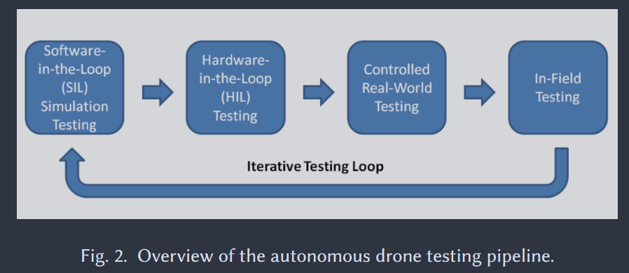

# Research Directions for Testing

### Motivation

> Traditional software testing practices like agile culture, test-driven development (TDD), DevOps methodologies, and regression testing offer quick feedback loops for developers. Yet, adapting these techniques for simulation-based tests is uncertain [1]

I like TDD :)

### Papers
[1] [A Roadmap for Simulation-Based Testing of Autonomous Cyber-Physical Systems: Challenges and Future Direction](https://dl.acm.org/doi/10.1145/3711906)

[2] [A Step-by-Step Guide to Creating a Robust Autonomous Drone Testing Pipeline](https://arxiv.org/abs/2506.11400)

[3] [AutonomyLens: A Self-Evolving Simulation-Based Testing Loop  for Autonomous Systems](https://dl.acm.org/doi/10.1145/3803437.3805539)

[4] [The Oracle Problem in Software Testing: A Survey](https://ieeexplore.ieee.org/document/6963470)

### Review
The theoretical model for testing is summarised in [1]. A test case $\theta$ is made up of 4 elements:

$$
\theta = (S, E, T, O)
$$

|Testing Concept| Description| Software Examples | ACPS (UAV, AMR, SDC) |
|-|-|-|-
Subject, S | thing to test | Web app, Mobile App | Drone system
Environment, E | location to test in | Browser, Server, OS | Testing Lab, Real world deployment location
Task, T | **sequence of actions** to perform using S | **enrol in a course** using student services app | drone **returns home from unknown position**
Oracle, O | what we want to happen i.e. goal, requirement, expectation | student is enrolled in course | drone is safely home

The paper explains 5 challenges:

1. Defining the Testing Task and the Oracle

In my examples above, the task for software is more intuitive to break down into the sequence of actions:

    1. go to SSO URL
    2. click enrol section
    3. search for course code
    4. select classes
    5. click 'confirm enrolment'

and asserting with oracle is also simple:

go to list of enrolled courses and check course code is element of list

But how do you break down "returns to home"? Perhaps it is a sequence of drone motion (rotate 15deg, translate 10m in x axis, ....). Or maybe waypoints (1. start, W1, W2,..., home). But will the developer need to make a different test case for every different starting location? What if the developer wants a higher abstraction? E.g. "Take fastest route", "Take unexplored route"

In what ways can constructing this sequence be made simpler? For example,Developer could draw out the route and that automatically generates the waypoints. [3] uses LLMs to automate some of the tedious 

<!-- > In ACPS simulation-based testing, defining task, T and asserting with oracle, O is challenging -->

2. Defining the Environment

Environment for software = OS, or simpler like a web browser, easy to reproduce if following docs or using tools like Docker.

Deployment Environment for ACPS = 3D world, has physics, known/unknown static/dynamic obstacles, difficult to control due to complexity to develop simulations, or difficult to control real conditions (wind, sunlight, sensor subjects). 

There are lots of alternative testing & development environments [2] for ACPS that have different pros & cons:

| Simulation | Hardware + Simulation | Controlled real-world | In-field conditions 
|-|-|-|-|
|Low Execution Time| Low execution Time| Can't be sped up | Can't be sped up  |
|Extra development & setup effort | Extra development & setup effort  | Requires physical lab space for drone motion | Requires authorisation to deploy system in-field  
| open-source simulations, or partial implementations | rare | 

3. Reality Gap

4. Lack of Benchmarks and 5. Need of Cost-Effective Solutions

These two challenges are practical not theoretical "hence advocating for tailored solutions to address the unique demands of autonomous systems" [1]. 

### Research Directions

#### idea 1. presenting a novel solution

What makes X an effective solution to automatically and externally test robot systems?

* Readable, extendable test cases in an accessible language
    * Python for Robot OS2 systems
    * Intuitive utility functions to describe goals

* Minimal changes to the actual drone or environment during testing:
    * Mass & size of robot
    * No need to setup expensive or physically demanding elements in the environment

* External testing
    * test correct behaviour without knowledge of internal mechanisms/algorithms

* Benchmarking

* Debugging 
    * internal logs don't aid the test results, but could help find issues causing test results

[rosbag2](https://github.com/ros2/rosbag2) provides a simple way to store & replay the robot run. 

<!-- Theoretically, several techniques could be used to measure how well the robot did, but maybe then need to packaged in an accessible format for developers. The accessibility of the  -->

#### idea 2. novel methodologies

Research questions:

* What types of readable UAV goals translate into boolean assertions to minimise the Human Oracle Cost [reference 4, section 7.1]?
     <!--
     Despite the lack of an automated test oracle, software engineering research can still play a key role: finding ways to reduce the effort that the human tester has to expend in directly creating, or in being, the test oracle.

    This effort is referred to as the Human Oracle Cost [125]. It aims to reduce the cost of human involvement along two dimensions: 1) writing test oracles and 2) evaluating test outcomes
     
       -->

    <!-- Here is just one test case to paint a picture:

    * Human readable goal: "Return to home from location (X, Y, Z)"
    * Translation step 1: describe or automatically generate waypoints
    * Translation step 2: provide tolerance for accuracy (0.5m from each waypoint), speed (completes within X seconds) or efficiency (deviation from an ideal path).
    * Translation output: a function to call on each actual drone location, which returns pass/fail. -->

* How lightweight & inexpensive mechanisms can be used to prepare a UAV for autonomous E2E testing?
    * novel idea here is *autonomous*: imagine if the drone takes off, executes its program, returns to origin, lands, starts charging, and an independent system tested the entire run. The process could be repeated with one click, or automatically in a loop. None of the papers said the testing could be autonomous i.e. no human required to test drone, including [4] which said: 
        > AutonomyLens frames autonomy validation as an artifact-centered, feedback-driven workflow: the goal is not a pass/fail label, but an evolving body of evidence linking scenario intent, execution traces, and developer-facing claims

    * cost, mass and physical size can be used to compare between mechanisms
    * 2 lightweight & affordable mechanisms I've seen on YouTube:
        - camera + IR: https://www.youtube.com/watch?v=0ql20JKrscQ
        - camera + aruco marker: https://www.youtube.com/watch?v=mWvuBfGUugk

## Feedback 

from Talia

- start with something specific

> ground-up approach rather than top down

- new idea: types of goals (at each goal, what new components, and what new testing)

- verification of artifact/methodology?
- what is actually improving?

- phone mechanism for preparing E2E testing?

- how does it help? 
- what does it improve? 
- how do you validate it? 
- how to measure it?

from Marc

- Nothing like this heard about before! 

